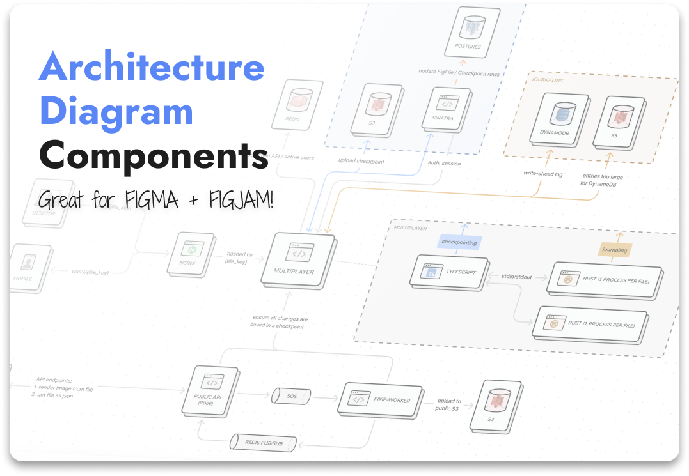

# architecture-diagram-components
Check out [this project](https://www.figma.com/community/file/989635781221754599) in the Figma community! 

---

Create beautiful and informative architecture diagrams with these components - usable in Figma + FigJam! These components are also useful for system design interviews 🤓.

  

Check out this [example diagram](https://www.figma.com/community/file/989634471195357925?fuid=839190457814534351) we made 📈.

## Usage:
To use these components in your own files:

* Duplicate the community file!
* You can either: publish the components as a library (if you're on a professional plan) and import them via the component tab in FigJam. This has the advantage of maintaining the links between the components and the library.
* OR copy and paste components directly in your FigJam or Figma file.

This library provides variants of all of the various components, use them to denote things like "this service is owned by us" vs "this is an external service".

🚨 In order to resize the "Frame" component, type random text into the hidden text-box. This allows us to resize width / height independently and avoids scaling up the object.

🚨 In order to replace the database / service / user icon, place an icon component on top. This will not be necessary once FigJam is updated to work with nested variants (looking at you FigJam fam 👀).

## Contributing
🙏🏻! Check out the [CONTRIBUTING.md](./CONTRIBUTING.md) for more information and instructions.